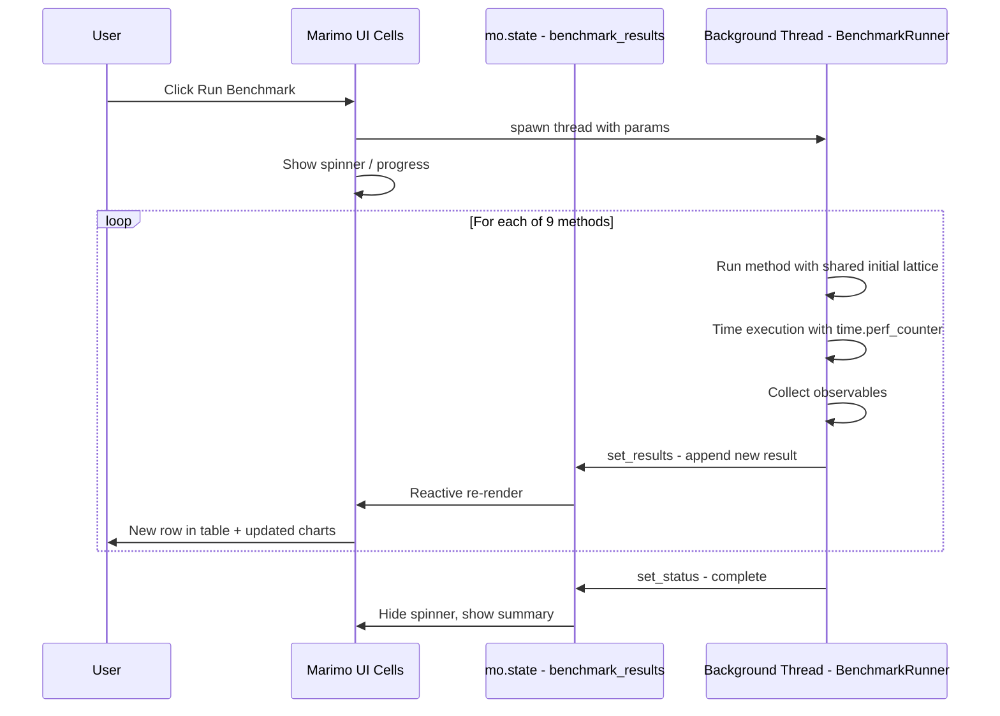
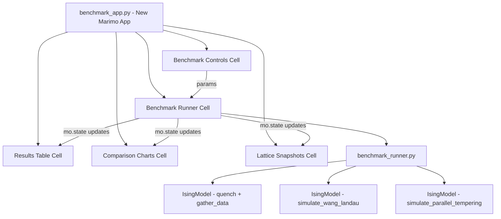
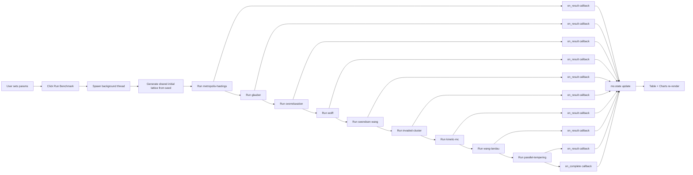

# PyIsing Benchmarking Dashboard — Design Document

## 1. Overview

A new **Benchmark** section in the existing Marimo app that runs all 9 Monte Carlo methods under identical conditions, streams results progressively to the UI as each method completes, and displays side-by-side comparison charts of physically relevant observables plus wall-clock timing.

### Methods Under Test

| # | Method Key | Invocation Style | Notes |
|---|-----------|-----------------|-------|
| 1 | `metropolis-hastings` | Frame-by-frame via `quench()` | Checkerboard on GPU |
| 2 | `glauber` | Frame-by-frame via `quench()` | Checkerboard on GPU |
| 3 | `overrelaxation` | Frame-by-frame via `quench()` | Checkerboard on GPU |
| 4 | `wolff` | Frame-by-frame via `quench()` | Always CPU, cluster |
| 5 | `swendsen-wang` | Frame-by-frame via `quench()` | Always CPU, cluster |
| 6 | `invaded-cluster` | Frame-by-frame via `quench()` | Always CPU, cluster |
| 7 | `kinetic-mc` | Frame-by-frame via `quench()` | Always CPU, event-driven |
| 8 | `wang-landau` | Standalone `simulate_wang_landau()` → `wang_landau_observables()` | Density of states |
| 9 | `parallel-tempering` | Standalone `simulate_parallel_tempering()` | Replica exchange |

### Observables Collected Per Method

- **Energy per spin** ⟨E⟩
- **Magnetization per spin** ⟨M⟩
- **Specific heat capacity** ⟨C⟩
- **Magnetic susceptibility** ⟨χ⟩
- **Wall-clock time** (seconds)
- **Final lattice snapshot** (optional heatmap)

---

## 2. Architecture

### 2.1 Why Not Native SSE?

The existing app uses **Marimo** — a reactive, cell-based Python notebook framework. Marimo does not expose a raw HTTP endpoint for Server-Sent Events. Instead, Marimo provides:

- **Reactive cells** — cells re-execute when their dependencies change
- **`mo.state()`** — mutable reactive state that triggers downstream cell re-renders when updated
- **`mo.ui.run_button()`** — user-triggered execution
- **`mo.status.spinner()`** — loading indicators
- **Background threads** — Python threads can update `mo.state()` from outside the cell graph

### 2.2 SSE-Equivalent Pattern in Marimo

We simulate SSE semantics using **`mo.state()` + a background thread**:

1. User clicks **▶ Run Benchmark**
2. A background `threading.Thread` is spawned that runs each method sequentially
3. After each method completes, the thread calls `set_results(updated_list)` on a `mo.state()` variable
4. Marimo's reactivity detects the state change and re-renders all downstream cells — the results table, comparison charts, and lattice snapshots update incrementally
5. Each state update is the SSE-equivalent "event" — the frontend sees a new method result appear

This gives the user the same experience as SSE: results stream in one-by-one as methods complete.

### 2.3 System Diagram



### 2.4 Component Diagram



---

## 3. Backend Design

### 3.1 Benchmark Runner Module — `benchmark_runner.py`

A pure-Python module with no Marimo dependency, so it can be tested independently.

#### Core Function Signature

```python
def run_benchmark(
    nrows: int,
    ncols: int,
    beta: float,
    h: float,
    tf: int,
    fps: int,
    seed: int,
    use_gpu: bool,
    on_result: Callable[[dict], None],   # SSE-equivalent callback
    on_complete: Callable[[], None],
    wl_flatness: float = 0.8,
    wl_f_min: float = 1e-8,
    wl_max_sweeps: int = 10000,
    pt_n_sweeps: int = 100,
    pt_swap_interval: int = 1,
) -> list[dict]:
```

#### Ensuring Identical Initial Conditions

The key challenge: all methods must start from the **same** random lattice configuration.

**Strategy:**

1. Create a master `np.random.default_rng(seed)` 
2. Generate the initial lattice once: `initial_lattice = 2 * rng.integers(0, 2, size=(nrows, ncols)).astype(np.int8) - 1`
3. For each frame-by-frame method:
   - Create a fresh `IsingModel` with the same parameters
   - **Overwrite** `ising.at[0]` with a copy of `initial_lattice`
   - Overwrite `ising.rng` with a fresh `np.random.default_rng(seed)` so the MC sampling is reproducible per-method
   - Call `ising.quench()` + `ising.gather_data()`
4. For Wang-Landau and Parallel Tempering:
   - Create a fresh `IsingModel` with the same parameters
   - Overwrite `ising.rng` with `np.random.default_rng(seed)`
   - These methods create their own internal lattices, but the seeded RNG ensures reproducibility

**Note on RNG seeding:** Each method gets the *same* seed so that the random number sequence is identical at the start. This means methods that use the same update logic will produce identical trajectories, which is the correct behavior for a fair benchmark.

#### Method Execution Loop

```python
FRAME_METHODS = [
    'metropolis-hastings', 'glauber', 'overrelaxation',
    'wolff', 'swendsen-wang', 'invaded-cluster', 'kinetic-mc',
]

def run_benchmark(...):
    results = []
    
    # Generate shared initial lattice
    master_rng = np.random.default_rng(seed)
    initial_lattice = (
        2 * master_rng.integers(0, 2, size=(nrows, ncols)).astype(np.int8) - 1
    )
    
    # --- Frame-by-frame methods ---
    for method in FRAME_METHODS:
        ising = IsingModel(
            nrows=nrows, ncols=ncols, tf=tf, fps=fps,
            beta=beta, h=h, method=method, use_gpu=use_gpu,
        )
        ising.rng = np.random.default_rng(seed)
        ising.at[0] = ising.xp.asarray(initial_lattice.copy())
        
        t0 = time.perf_counter()
        ising.quench(verbose=False)
        ising.gather_data(verbose=False)
        wall_time = time.perf_counter() - t0
        
        result = _extract_observables(ising, method, wall_time)
        results.append(result)
        on_result(result)
    
    # --- Wang-Landau ---
    ising_wl = IsingModel(
        nrows=nrows, ncols=ncols, tf=tf, fps=fps,
        beta=beta, h=h, use_gpu=False,  # WL is CPU-only
    )
    ising_wl.rng = np.random.default_rng(seed)
    
    t0 = time.perf_counter()
    wl_result = ising_wl.simulate_wang_landau(
        flatness=wl_flatness, f_min=wl_f_min, max_mc_sweeps=wl_max_sweeps,
    )
    wl_df = ising_wl.wang_landau_observables(wl_result, beta_range=[beta])
    wall_time = time.perf_counter() - t0
    
    result = _extract_wl_observables(wl_df, wall_time)
    results.append(result)
    on_result(result)
    
    # --- Parallel Tempering ---
    ising_pt = IsingModel(
        nrows=nrows, ncols=ncols, tf=tf, fps=fps,
        beta=beta, h=h, use_gpu=use_gpu,
    )
    ising_pt.rng = np.random.default_rng(seed)
    
    t0 = time.perf_counter()
    pt_df = ising_pt.simulate_parallel_tempering(
        beta_range=np.linspace(0.5 * beta, 2.0 * beta, 8),
        h=h, n_sweeps=pt_n_sweeps, swap_interval=pt_swap_interval,
    )
    wall_time = time.perf_counter() - t0
    
    # Extract the row closest to the target beta
    result = _extract_pt_observables(pt_df, beta, wall_time)
    results.append(result)
    on_result(result)
    
    on_complete()
    return results
```

#### Observable Extraction Helpers

```python
def _extract_observables(ising, method, wall_time) -> dict:
    """Extract final-frame observables from a quenched IsingModel."""
    final = ising.frames - 1
    lattice_np = _to_numpy(ising.at[final])
    return {
        'method': method,
        'energy': float(ising.energy[final]),
        'magnetization': float(ising.magnetization[final]),
        'specific_heat': float(ising.specific_heat_capacity[final]),
        'susceptibility': float(ising.magnetic_susceptibility[final]),
        'wall_time': wall_time,
        'lattice': lattice_np.tolist(),  # for heatmap rendering
    }
```

### 3.2 Handling Wang-Landau Differently

Wang-Landau does not produce frame-by-frame lattice evolution. Instead:

- It estimates the density of states `log g(E)`
- `wang_landau_observables()` computes canonical averages at specified β values
- We call it with `beta_range=[beta]` to get a single-point result comparable to the other methods
- **Magnetization and susceptibility are zero** from WL (it only tracks energy) — this is noted in the UI
- **No final lattice snapshot** is available — the UI shows a placeholder

### 3.3 Handling Parallel Tempering Differently

Parallel Tempering runs multiple replicas at different temperatures simultaneously:

- We create a small β ladder centered around the target β: `np.linspace(0.5*β, 2.0*β, 8)`
- After simulation, we extract the row from the returned DataFrame whose `ThermodynamicBeta` is closest to the target β
- The final lattice for that replica is not directly accessible from the current API — we note this limitation
- **Specific heat and susceptibility are zero** in the current PT implementation — noted in the UI

---

## 4. Frontend Design

### 4.1 New Marimo App: `benchmark_app.py`

A separate Marimo app file (not merged into the existing `app.py`) to keep concerns separated. It can be launched with `marimo run benchmark_app.py`.

### 4.2 Layout

```
┌─────────────────────────────────────────────────────────┐
│  🧲 PyIsing — Benchmark Dashboard                       │
│  Compare all 9 Monte Carlo methods side-by-side         │
├─────────────────────────────────────────────────────────┤
│  ⚙️ Parameters                                          │
│  ┌──────────┐ ┌──────────┐ ┌──────────┐ ┌───────────┐  │
│  │ Lattice  │ │ β slider │ │ h slider │ │ Frames    │  │
│  │ NxN      │ │          │ │          │ │ tf × fps  │  │
│  └──────────┘ └──────────┘ └──────────┘ └───────────┘  │
│  ┌──────────┐ ┌──────────────────────────────────────┐  │
│  │ Seed     │ │ ▶ Run Benchmark                      │  │
│  └──────────┘ └──────────────────────────────────────┘  │
├─────────────────────────────────────────────────────────┤
│  📊 Results Table                                       │
│  ┌─────────────────────────────────────────────────────┐│
│  │ Method │ ⟨E⟩ │ ⟨M⟩ │ ⟨C⟩ │ ⟨χ⟩ │ Time(s) │ Status ││
│  │ MH     │ ... │ ... │ ... │ ... │ 1.23    │ ✅     ││
│  │ Glauber│ ... │ ... │ ... │ ... │ 0.98    │ ✅     ││
│  │ Wolff  │     │     │     │     │         │ ⏳     ││
│  │ ...    │     │     │     │     │         │ ⏸️     ││
│  └─────────────────────────────────────────────────────┘│
├─────────────────────────────────────────────────────────┤
│  📈 Comparison Charts                                   │
│  ┌─────────────┐ ┌─────────────┐                        │
│  │ Energy      │ │ Magnetiz.   │                        │
│  │ bar chart   │ │ bar chart   │                        │
│  └─────────────┘ └─────────────┘                        │
│  ┌─────────────┐ ┌─────────────┐                        │
│  │ Spec. Heat  │ │ Suscept.    │                        │
│  │ bar chart   │ │ bar chart   │                        │
│  └─────────────┘ └─────────────┘                        │
│  ┌──────────────────────────────┐                       │
│  │ Wall-Clock Time              │                       │
│  │ horizontal bar chart         │                       │
│  └──────────────────────────────┘                       │
├─────────────────────────────────────────────────────────┤
│  🔬 Final Lattice Snapshots (optional)                  │
│  ┌────┐ ┌────┐ ┌────┐ ┌────┐ ┌────┐ ┌────┐ ┌────┐     │
│  │ MH │ │Gla │ │OR  │ │Wlf │ │SW  │ │IC  │ │KMC │     │
│  └────┘ └────┘ └────┘ └────┘ └────┘ └────┘ └────┘     │
└─────────────────────────────────────────────────────────┘
```

### 4.3 Cell Structure

| Cell | Purpose | Reactive Dependencies |
|------|---------|----------------------|
| `_imports` | Import all modules | — |
| `_hardware` | Detect GPU, set `use_gpu` | — |
| `_sidebar` | Hardware info sidebar | `gpu_badge` |
| `_header` | Title and description | — |
| `_bench_controls` | Parameter sliders + Run button | `BETA_CRIT` |
| `_bench_state` | `mo.state()` for results list and status | — |
| `_bench_runner` | Spawns background thread on button click | Controls + state setter |
| `_bench_table` | Renders results as `mo.ui.table()` | `get_results` state |
| `_bench_charts` | Renders 5 comparison bar charts | `get_results` state |
| `_bench_snapshots` | Renders lattice heatmaps in a row | `get_results` state |

### 4.4 Consuming SSE-Equivalent Events

```python
@app.cell
def _bench_state(mo):
    get_results, set_results = mo.state([])
    get_status, set_status = mo.state('idle')  # idle | running | complete
    return get_results, set_results, get_status, set_status

@app.cell
def _bench_runner(mo, set_results, set_status, ...params...):
    mo.stop(not run_button.value)
    
    import threading
    from benchmark_runner import run_benchmark
    
    set_status('running')
    set_results([])
    
    def on_result(result):
        # Append to existing results — triggers reactive re-render
        current = get_results()
        set_results(current + [result])
    
    def on_complete():
        set_status('complete')
    
    thread = threading.Thread(
        target=run_benchmark,
        kwargs=dict(
            nrows=nrows_slider.value,
            ncols=ncols_slider.value,
            beta=beta_slider.value,
            h=h_slider.value,
            tf=tf_slider.value,
            fps=fps_slider.value,
            seed=seed_input.value,
            use_gpu=use_gpu,
            on_result=on_result,
            on_complete=on_complete,
        ),
        daemon=True,
    )
    thread.start()
```

### 4.5 Chart Rendering

Each chart cell reads `get_results()` and renders only the methods that have completed so far:

```python
@app.cell
def _bench_charts(get_results, mo, plt, np):
    results = get_results()
    if not results:
        mo.stop(True, mo.callout(mo.md('Waiting for benchmark results...'), kind='info'))
    
    methods = [r['method'] for r in results]
    energies = [r['energy'] for r in results]
    # ... similar for other observables
    
    fig, axes = plt.subplots(2, 3, figsize=(18, 8))
    # Bar chart for each observable
    # Color-code by method category: local=blue, cluster=green, advanced=orange
    ...
```

### 4.6 Lattice Snapshot Rendering

```python
@app.cell
def _bench_snapshots(get_results, mo, plt, np):
    results = get_results()
    snapshots = [(r['method'], r['lattice']) for r in results if r.get('lattice')]
    
    if not snapshots:
        return
    
    n = len(snapshots)
    fig, axes = plt.subplots(1, n, figsize=(3 * n, 3))
    for ax, (method, lattice) in zip(axes, snapshots):
        ax.imshow(lattice, cmap='coolwarm', vmin=-1, vmax=1, interpolation='nearest')
        ax.set_title(method, fontsize=8)
        ax.axis('off')
    ...
```

---

## 5. SSE Event Format

Although we use `mo.state()` rather than HTTP SSE, the data structure passed through `on_result()` follows a well-defined JSON-equivalent schema. This makes it easy to adapt to a true SSE endpoint in the future.

### 5.1 Method Result Event

```json
{
    "event": "method_result",
    "data": {
        "method": "metropolis-hastings",
        "category": "local",
        "energy": -1.7432,
        "magnetization": 0.8921,
        "specific_heat": 0.4512,
        "susceptibility": 0.0234,
        "wall_time": 1.234,
        "lattice": [[1, -1, 1, ...], ...],
        "params": {
            "nrows": 50,
            "ncols": 50,
            "beta": 0.4407,
            "h": 0.0,
            "frames": 100,
            "seed": 42
        }
    }
}
```

### 5.2 Status Event

```json
{
    "event": "status",
    "data": {
        "status": "running",
        "current_method": "wolff",
        "methods_completed": 3,
        "methods_total": 9
    }
}
```

### 5.3 Completion Event

```json
{
    "event": "complete",
    "data": {
        "total_wall_time": 45.67,
        "methods_completed": 9
    }
}
```

### 5.4 Method Categories

Methods are tagged with a `category` for color-coding in charts:

| Category | Methods | Chart Color |
|----------|---------|-------------|
| `local` | metropolis-hastings, glauber, overrelaxation | Blue shades |
| `cluster` | wolff, swendsen-wang, invaded-cluster | Green shades |
| `advanced` | kinetic-mc, wang-landau, parallel-tempering | Orange shades |

### 5.5 Special Cases in Event Data

| Method | `lattice` field | `specific_heat` | `susceptibility` | Notes |
|--------|----------------|-----------------|-------------------|-------|
| Frame-by-frame methods | Final frame lattice | Computed | Computed | Full data |
| `wang-landau` | `null` | From density of states | `null` — WL does not track M | Energy-only method |
| `parallel-tempering` | `null` | `null` — not computed in current API | `null` | Only E and M from final config |

---

## 6. Technology Choices

| Concern | Choice | Rationale |
|---------|--------|-----------|
| Web framework | **Marimo** | Existing app uses Marimo; no new framework introduced |
| Reactive streaming | **`mo.state()` + `threading.Thread`** | Marimo-native way to push incremental updates |
| Charts | **Matplotlib** | Already a dependency; consistent with existing app |
| Lattice heatmaps | **`plt.imshow()` with coolwarm colormap** | Matches existing lattice viewer |
| Data tables | **`mo.ui.table()`** | Marimo-native interactive table |
| Timing | **`time.perf_counter()`** | High-resolution wall-clock timer |
| RNG seeding | **`np.random.default_rng(seed)`** | Reproducible benchmarks |

### 6.1 No New Dependencies Required

All functionality is achievable with existing dependencies:
- `numpy` — array operations, RNG
- `matplotlib` — charts and heatmaps
- `pandas` — DataFrame for table display
- `marimo` — UI framework
- `threading` — standard library, background execution
- `time` — standard library, performance timing

---

## 7. File Structure

### 7.1 New Files

| File | Purpose |
|------|---------|
| `PyIsing/benchmark_app.py` | New Marimo app for the benchmark dashboard |
| `PyIsing/src/pyising/benchmark_runner.py` | Pure-Python benchmark orchestrator with callback-based streaming |

### 7.2 Modified Files

| File | Change |
|------|--------|
| `PyIsing/src/pyising/__init__.py` | Add `benchmark_runner` to exports |
| `PyIsing/pyproject.toml` | No changes needed — all deps already present |
| `PyIsing/app.py` | No changes — benchmark is a separate app |

### 7.3 Directory Layout After Implementation

```
PyIsing/
├── app.py                          # Existing Marimo app (unchanged)
├── benchmark_app.py                # NEW — Benchmark dashboard Marimo app
├── BENCHMARK_DESIGN.md             # This design document
├── DESIGN.md                       # Existing design doc
├── pyproject.toml                  # Unchanged
├── src/
│   └── pyising/
│       ├── __init__.py             # Updated exports
│       ├── benchmark_runner.py     # NEW — Benchmark orchestrator
│       ├── constants.py            # Unchanged
│       ├── hardware.py             # Unchanged
│       └── model.py                # Unchanged
```

---

## 8. Data Flow — End to End



---

## 9. Edge Cases and Considerations

### 9.1 Large Lattice Sizes

For lattices > 100×100, some CPU-only methods like `kinetic-mc` and `invaded-cluster` will be very slow. The UI should:
- Show a warning callout when lattice size × frames exceeds a threshold
- Display a per-method progress indicator via the status state

### 9.2 Wang-Landau Convergence

Wang-Landau may take a very long time to converge for large lattices. The `max_mc_sweeps` parameter caps this, but the user should be warned. Default WL parameters should be conservative for benchmarking:
- `flatness=0.8`
- `f_min=1e-6` (less strict than default `1e-8` for faster benchmarks)
- `max_mc_sweeps=5000`

### 9.3 GPU Memory

Running 9 methods sequentially means only one `IsingModel` is alive at a time. GPU memory is not a concern since each model is created and destroyed per method.

### 9.4 Thread Safety

`mo.state()` setters are thread-safe in Marimo. The background thread only calls `set_results()` and `set_status()` — it does not read or modify any Marimo UI elements directly.

### 9.5 Cancellation

Marimo does not natively support cancelling background threads. If the user clicks Run Benchmark again while one is running:
- The new click should be ignored (button disabled while `status == 'running'`)
- Alternatively, set a `threading.Event` flag that the runner checks between methods

### 9.6 Reproducibility

Using the same seed guarantees:
- Identical initial lattice for all frame-by-frame methods
- Identical RNG sequence for each method's MC sampling
- Wang-Landau and Parallel Tempering start from the same RNG state

This means re-running with the same seed produces identical results, enabling fair comparisons.

---

## 10. Implementation Checklist

1. Create `PyIsing/src/pyising/benchmark_runner.py` with `run_benchmark()` function
2. Create `PyIsing/benchmark_app.py` with all Marimo cells
3. Update `PyIsing/src/pyising/__init__.py` to export `run_benchmark`
4. Test with small lattice (10×10, 10 frames) to verify all 9 methods complete
5. Test SSE-equivalent streaming by watching results appear incrementally
6. Test with GPU enabled to verify checkerboard methods use GPU
7. Verify identical initial conditions by comparing frame-0 lattices across methods
