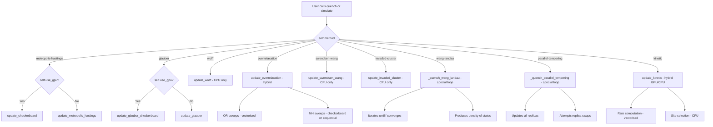
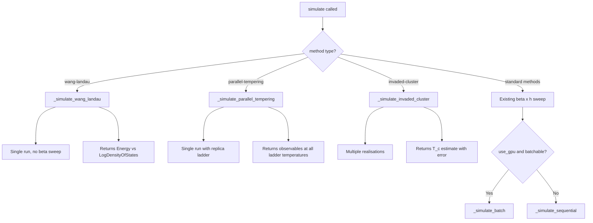
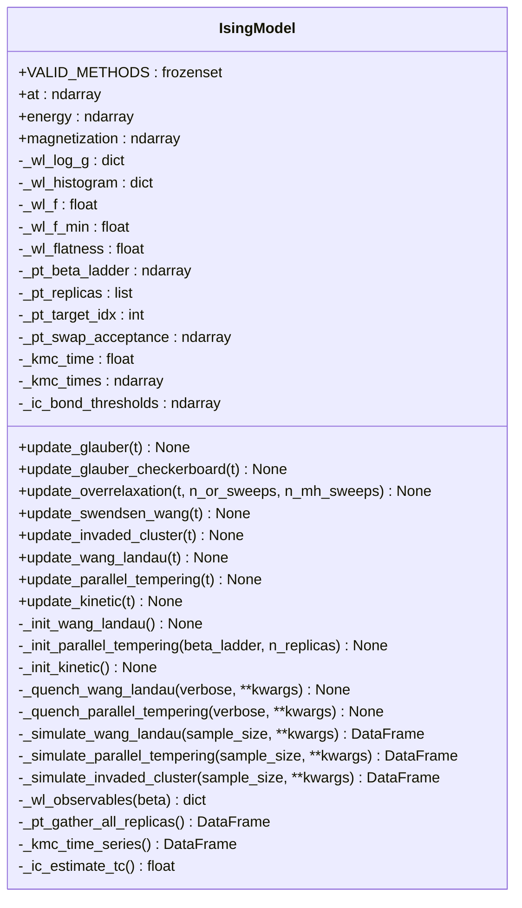

# PyIsing — Integration Design for 7 New Monte Carlo Methods

> **Status:** Design document — no code changes yet.
> **Target file:** `src/pyising/model.py` (all methods added to the existing `IsingModel` class).

---

## Table of Contents

1. [Method String Constants](#1-method-string-constants)
2. [Method Signatures](#2-method-signatures)
3. [Integration with quench / simulate](#3-integration-with-quench--simulate)
4. [GPU Strategy](#4-gpu-strategy)
5. [Data Flow & Observable Computation](#5-data-flow--observable-computation)
6. [Special Considerations](#6-special-considerations)
7. [Dependencies](#7-dependencies)
8. [Dispatch Architecture Diagram](#8-dispatch-architecture-diagram)

---

## 1. Method String Constants

Each algorithm is identified by a lowercase string stored in `self.method`. The existing values are preserved; new ones are added:

| String Constant | Algorithm | Category |
|---|---|---|
| `'metropolis-hastings'` | Metropolis-Hastings (existing) | Single-spin-flip |
| `'wolff'` | Wolff cluster (existing) | Cluster |
| `'glauber'` | Glauber / Heat Bath | Single-spin-flip |
| `'overrelaxation'` | Overrelaxation (Microcanonical) | Hybrid |
| `'swendsen-wang'` | Swendsen-Wang | Cluster |
| `'invaded-cluster'` | Invaded Cluster | Cluster / Self-tuning |
| `'wang-landau'` | Wang-Landau | Flat histogram |
| `'parallel-tempering'` | Parallel Tempering (Replica Exchange) | Ensemble |
| `'kinetic'` | Kinetic Monte Carlo | Event-driven |

A class-level constant should be added for validation:

```python
VALID_METHODS = frozenset({
    'metropolis-hastings', 'wolff', 'glauber', 'overrelaxation',
    'swendsen-wang', 'invaded-cluster', 'wang-landau',
    'parallel-tempering', 'kinetic',
})
```

The `__init__` method should validate `method in VALID_METHODS` and raise `ValueError` otherwise.

---

## 2. Method Signatures

All new `update_*` methods follow the existing convention: they read from frame `t` and write to frame `t + 1` in `self.at`. Methods that deviate from this pattern are noted explicitly.

### 2.1 Glauber (Heat Bath)

```python
def update_glauber(self, t: int) -> None:
    """
    Single-spin-flip heat-bath update.

    For each randomly chosen site, the flip probability is:
        P(flip) = 1 / (1 + exp(beta * delta_E))
    where delta_E is the energy change from flipping.

    Writes result to self.at[t + 1].
    """
```

**Checkerboard variant** for GPU:

```python
def update_glauber_checkerboard(self, t: int) -> None:
    """
    Parallel checkerboard Glauber / heat-bath update (GPU-optimised).

    Same acceptance rule as update_glauber but applied simultaneously
    to all sites in each sublattice.

    Writes result to self.at[t + 1].
    """
```

### 2.2 Overrelaxation (Microcanonical)

```python
def update_overrelaxation(self, t: int, n_or_sweeps: int = 1, n_mh_sweeps: int = 1) -> None:
    """
    Microcanonical overrelaxation mixed with Metropolis-Hastings sweeps.

    For each overrelaxation sweep: flip spin s_i -> -s_i only when the
    local field h_local = J * sum(neighbours) + mu * h is exactly zero
    (i.e., the flip is energy-preserving).

    After n_or_sweeps overrelaxation sweeps, perform n_mh_sweeps standard
    Metropolis-Hastings sweeps to ensure ergodicity.

    Parameters
    ----------
    t : int
        Source frame index.
    n_or_sweeps : int
        Number of overrelaxation sweeps per step.
    n_mh_sweeps : int
        Number of Metropolis-Hastings sweeps per step (for ergodicity).

    Writes result to self.at[t + 1].
    """
```

### 2.3 Swendsen-Wang

```python
def update_swendsen_wang(self, t: int) -> None:
    """
    Swendsen-Wang cluster algorithm.

    1. For every nearest-neighbour pair with equal spins, activate the bond
       with probability p = 1 - exp(-2 * beta * J).
    2. Identify connected clusters of activated bonds.
    3. Independently flip each cluster with probability 1/2.

    Writes result to self.at[t + 1].
    """
```

### 2.4 Invaded Cluster

```python
def update_invaded_cluster(self, t: int) -> None:
    """
    Invaded cluster algorithm — a single step.

    1. Start from a seed site and grow a cluster by adding bonds in order
       of their random weight (uniform [0, 1]), lowest first.
    2. Stop when the cluster percolates (wraps around the lattice in any
       direction via periodic boundaries).
    3. Flip the entire cluster.

    This algorithm self-tunes to the critical point; no beta is needed
    for the cluster growth (beta only enters through the bond threshold
    at convergence).

    Writes result to self.at[t + 1].
    """
```

### 2.5 Wang-Landau

```python
def update_wang_landau(self, t: int) -> None:
    """
    A single Wang-Landau spin-flip proposal.

    Proposes flipping a random spin. Accepts with probability
        P(accept) = min(1, g(E_old) / g(E_new))
    where g(E) is the current estimate of the density of states.

    On acceptance, updates self.at[t + 1] and modifies self._wl_log_g
    and self._wl_histogram in place.

    Writes result to self.at[t + 1].
    """
```

**Additional state attributes** (initialised in a helper):

```python
def _init_wang_landau(self) -> None:
    """
    Initialise Wang-Landau state variables.

    Sets up:
        self._wl_log_g : dict[float, float]
            Log of the density of states, keyed by energy.
        self._wl_histogram : dict[float, int]
            Visit histogram, keyed by energy.
        self._wl_f : float
            Current modification factor (starts at e = 2.71828...).
        self._wl_f_min : float
            Convergence threshold for f (e.g. exp(1e-8)).
        self._wl_flatness : float
            Flatness criterion (default 0.8).
    """
```

### 2.6 Parallel Tempering (Replica Exchange)

```python
def update_parallel_tempering(self, t: int) -> None:
    """
    One parallel-tempering step across all replicas.

    1. For each replica, perform one standard update step (Metropolis-Hastings
       or checkerboard, depending on self.use_gpu) at its assigned temperature.
    2. Attempt swap moves between adjacent-temperature replicas:
       accept swap with probability
           P(swap) = min(1, exp((beta_i - beta_j) * (E_i - E_j)))

    Reads/writes self._pt_replicas[r][t] -> self._pt_replicas[r][t + 1]
    for each replica r. The primary self.at tracks the replica at the
    target temperature.

    Writes result to self.at[t + 1].
    """
```

**Additional state attributes:**

```python
def _init_parallel_tempering(self, beta_ladder: Optional[np.ndarray] = None,
                              n_replicas: int = 8) -> None:
    """
    Initialise parallel tempering state.

    Sets up:
        self._pt_beta_ladder : np.ndarray
            Array of inverse temperatures, shape (n_replicas,), sorted ascending.
        self._pt_replicas : list[xp.ndarray]
            List of n_replicas spin lattices, each shape (frames, nrows, ncols).
        self._pt_target_idx : int
            Index into beta_ladder corresponding to self.beta (the temperature
            of interest).
        self._pt_swap_acceptance : np.ndarray
            Running swap acceptance rates between adjacent replicas.

    Parameters
    ----------
    beta_ladder : np.ndarray or None
        Explicit temperature ladder. If None, a geometric ladder is
        generated spanning [0.5 * BETA_CRIT, 5 * BETA_CRIT].
    n_replicas : int
        Number of replicas (ignored if beta_ladder is provided).
    """
```

### 2.7 Kinetic Monte Carlo

```python
def update_kinetic(self, t: int) -> None:
    """
    Kinetic Monte Carlo (continuous-time) step.

    1. Compute the flip rate for every site:
       rate_i = min(1, exp(-beta * delta_E_i))  (Metropolis-like)
       or rate_i = 1 / (1 + exp(beta * delta_E_i))  (Glauber-like)
    2. Total rate R = sum of all rates.
    3. Advance physical time by dt = -ln(u) / R where u ~ Uniform(0,1).
    4. Select the flipping site with probability rate_i / R.
    5. Flip that site.

    Accumulates elapsed time in self._kmc_time.

    Writes result to self.at[t + 1].
    """
```

**Additional state attributes:**

```python
def _init_kinetic(self) -> None:
    """
    Initialise Kinetic Monte Carlo state.

    Sets up:
        self._kmc_time : float
            Accumulated physical time.
        self._kmc_times : np.ndarray
            Physical time at each frame, shape (frames,).
    """
```

---

## 3. Integration with quench / simulate

### 3.1 Updated quench Dispatch

The current [`quench()`](PyIsing/src/pyising/model.py:297) method uses a simple if/else. The new dispatch should use a dictionary mapping:

```python
def quench(self, beta=None, h=None, method=None, verbose=True, **kwargs):
    # ... existing beta/h/method setup ...

    # Dispatch table
    _DISPATCH = {
        'metropolis-hastings': self.update_checkerboard if self.use_gpu
                               else self.update_metropolis_hastings,
        'glauber':            self.update_glauber_checkerboard if self.use_gpu
                               else self.update_glauber,
        'wolff':              self.update_wolff,
        'overrelaxation':     self.update_overrelaxation,
        'swendsen-wang':      self.update_swendsen_wang,
        'invaded-cluster':    self.update_invaded_cluster,
        'kinetic':            self.update_kinetic,
    }

    # Methods requiring special simulation loops
    if self.method == 'wang-landau':
        self._quench_wang_landau(verbose=verbose, **kwargs)
        return
    if self.method == 'parallel-tempering':
        self._quench_parallel_tempering(verbose=verbose, **kwargs)
        return

    update_fn = _DISPATCH[self.method]
    _range = (trange(self.frames - 1, desc='Quenching System', leave=False)
              if verbose else range(self.frames - 1))
    for t in _range:
        update_fn(t)
```

### 3.2 Special Simulation Loops

#### Wang-Landau: `_quench_wang_landau`

Wang-Landau does **not** sweep over β. Instead it iteratively refines the density of states g(E) at a single configuration. The loop structure is:

```python
def _quench_wang_landau(self, verbose: bool = True, **kwargs) -> None:
    """
    Wang-Landau simulation loop.

    Replaces the standard frame-by-frame quench. Iterates until the
    modification factor f drops below self._wl_f_min.

    Each 'frame' in self.at stores a snapshot taken every N proposals
    (where N = self.size, i.e. one sweep).
    """
```

The `simulate()` method should detect `method == 'wang-landau'` and skip the β sweep entirely, instead returning a DataFrame with columns `['Energy', 'LogDensityOfStates']`.

#### Parallel Tempering: `_quench_parallel_tempering`

```python
def _quench_parallel_tempering(self, verbose: bool = True,
                                 beta_ladder: Optional[np.ndarray] = None,
                                 n_replicas: int = 8, **kwargs) -> None:
    """
    Parallel tempering quench loop.

    Initialises replicas if not already done, then evolves all replicas
    for self.frames - 1 steps, attempting replica swaps every step.

    The primary self.at array tracks the replica at self._pt_target_idx.
    """
```

The `simulate()` method should detect `method == 'parallel-tempering'` and, instead of sweeping β externally, let the replica exchange handle temperature exploration. A single call produces observables at all temperatures in the ladder.

#### Invaded Cluster: convergence in simulate

`invaded-cluster` works within the standard `quench()` loop but `simulate()` should **not** sweep β. Instead, it runs a single long quench and estimates T_c from the percolation threshold. The returned DataFrame should include a `'CriticalTemperature'` column.

### 3.3 Updated simulate Dispatch

```python
def simulate(self, beta_range=None, h_range=None, sample_size=30,
             method='wolff', **kwargs):
    # Special-case methods that replace the beta sweep
    if method == 'wang-landau':
        return self._simulate_wang_landau(sample_size=sample_size, **kwargs)
    if method == 'parallel-tempering':
        return self._simulate_parallel_tempering(
            sample_size=sample_size, **kwargs)
    if method == 'invaded-cluster':
        return self._simulate_invaded_cluster(
            sample_size=sample_size, **kwargs)

    # ... existing beta x h sweep for all other methods ...
```

### 3.4 Batch GPU Support in simulate

The existing [`_simulate_batch()`](PyIsing/src/pyising/model.py:403) should be extended to support `'glauber'` in addition to `'metropolis-hastings'`. The `use_batched` condition becomes:

```python
use_batched = self.use_gpu and method in {'metropolis-hastings', 'glauber'}
```

---

## 4. GPU Strategy

| Method | GPU-Accelerable? | Strategy |
|---|---|---|
| **Glauber** | ✅ Yes | Checkerboard decomposition, identical to MH but with heat-bath acceptance: `P = 1 / (1 + exp(beta * delta_E))` instead of `min(1, exp(-beta * delta_E))`. Reuse `_black_mask` / `_white_mask`. |
| **Overrelaxation** | ✅ Partial | The overrelaxation sweep is fully vectorisable (check `h_local == 0` for all sites simultaneously). The MH ergodicity sweeps use the existing checkerboard path on GPU. |
| **Swendsen-Wang** | ❌ CPU only | Connected-component labelling is inherently sequential. Use `scipy.ndimage.label` on CPU. Transfer lattice to/from GPU with `_to_numpy()` / `xp.asarray()`. |
| **Invaded Cluster** | ❌ CPU only | Priority-queue-driven cluster growth is sequential. Same CPU transfer pattern as Swendsen-Wang. |
| **Wang-Landau** | ❌ CPU only | Single-spin proposals with dictionary lookups for g(E) are inherently sequential. The energy delta computation could use GPU but the overhead of transfer dominates. |
| **Parallel Tempering** | ✅ Yes | Each replica's per-step update uses the GPU-accelerated checkerboard path. Swap decisions are scalar comparisons done on CPU. All replicas can be stacked into a batch dimension `(n_replicas, nrows, ncols)` for simultaneous update. |
| **Kinetic Monte Carlo** | ⚠️ Hybrid | Rate computation for all sites is vectorisable on GPU. Site selection and time advancement are scalar operations on CPU. Net benefit depends on lattice size. |

### GPU Transfer Pattern

For CPU-only methods running on a GPU-backed model:

```python
frame_cpu = _to_numpy(self.at[t]).copy()
# ... CPU algorithm on frame_cpu ...
self.at[t + 1] = self.xp.asarray(frame_cpu) if self.use_gpu else frame_cpu
```

This pattern is already used by [`update_wolff()`](PyIsing/src/pyising/model.py:262).

---

## 5. Data Flow & Observable Computation

### 5.1 Standard Methods

Methods that follow the `self.at[t] → self.at[t + 1]` convention (Glauber, Overrelaxation, Swendsen-Wang, Invaded Cluster, Kinetic MC) integrate seamlessly with the existing [`gather_data()`](PyIsing/src/pyising/model.py:319) loop. No changes needed — `E()`, `M()`, `C()`, `X()` all read from `self.at[t]`.

### 5.2 Wang-Landau

Wang-Landau produces a **density of states** g(E) rather than a time series of configurations. The observable flow is:

```
_quench_wang_landau()
  └─> self._wl_log_g : dict[float, float]   (primary output)
  └─> self.at[t] snapshots every N proposals  (for visualisation only)
```

Thermodynamic observables are computed **analytically** from g(E):

```python
def _wl_observables(self, beta: float) -> dict:
    """
    Compute canonical observables at arbitrary beta from the Wang-Landau
    density of states.

    Returns dict with keys: 'energy', 'specific_heat', 'magnetization',
    'susceptibility', 'free_energy'.
    """
```

This allows a single Wang-Landau run to produce the full β-dependence without re-simulating.

### 5.3 Parallel Tempering

Each replica maintains its own frame history. The primary `self.at` tracks the replica at the target temperature. Observables are gathered per-replica:

```
_quench_parallel_tempering()
  └─> self._pt_replicas[r] : xp.ndarray, shape (frames, nrows, ncols)
  └─> self.at = self._pt_replicas[self._pt_target_idx]  (alias)
```

After quenching, `gather_data()` works on `self.at` as usual. An additional method provides per-temperature observables:

```python
def _pt_gather_all_replicas(self) -> pd.DataFrame:
    """
    Gather observables from all replicas and return a DataFrame
    indexed by beta.
    """
```

### 5.4 Kinetic Monte Carlo

KMC advances in continuous time, so frame `t` does not correspond to a fixed real-time interval. The mapping is stored in `self._kmc_times[t]`. The existing `gather_data()` works unchanged (it indexes by frame, not by time). An additional accessor is provided:

```python
def _kmc_time_series(self) -> pd.DataFrame:
    """
    Return observables as a function of physical time rather than
    frame index.
    """
```

### 5.5 Invaded Cluster

The invaded cluster algorithm does not use β for cluster growth. The effective critical temperature is estimated from the bond threshold at percolation. An additional observable is stored:

```python
self._ic_bond_thresholds : np.ndarray  # shape (frames,)
```

The critical temperature estimate is:

```python
def _ic_estimate_tc(self) -> float:
    """
    Estimate T_c from the mean bond threshold at percolation.

    Returns T_c = -2J / (k_B * ln(1 - p_c)) where p_c is the mean
    percolation threshold.
    """
```

---

## 6. Special Considerations

### 6.1 Wang-Landau — Different Simulation Loop

- **Does not use β sweep.** The algorithm iteratively refines g(E) at a single temperature-independent level.
- **Convergence criterion:** The modification factor `f` is reduced (typically `f → sqrt(f)`) each time the energy histogram is "flat" (all bins within `self._wl_flatness` of the mean). Simulation ends when `f < self._wl_f_min`.
- **Frame storage:** Since the number of iterations is not known in advance, `self.at` should be pre-allocated to `self.frames` as usual, with snapshots taken every `self.size` proposals. If the algorithm converges before filling all frames, remaining frames are copies of the final state.
- **Energy discretisation:** For the 2D Ising model with J=1 and h=0, energies are integers in `[-2N, 2N]` with step 4 (where N = nrows * ncols). With h ≠ 0, the energy spectrum is denser. The implementation should use a dictionary keyed by rounded energy values.

### 6.2 Parallel Tempering — Replica Management

- **Memory:** Each replica requires `frames × nrows × ncols` bytes of int8 storage. With 8 replicas and a 100×100 lattice at 100 frames, this is ~8 MB — manageable. For GPU, all replicas can be stacked into a single `(n_replicas, frames, nrows, ncols)` tensor if memory permits, or processed sequentially.
- **Temperature ladder:** A geometric spacing `beta_ladder = np.geomspace(beta_low, beta_high, n_replicas)` provides good overlap near T_c. The user can also supply an explicit ladder.
- **Swap strategy:** Even-odd alternating swaps (swap pairs (0,1), (2,3), ... on even steps; (1,2), (3,4), ... on odd steps) to avoid conflicts.
- **Tracking:** After swaps, replica indices are permuted but temperatures stay fixed. The implementation must track which replica is at which temperature.

### 6.3 Invaded Cluster — Self-Tuning to T_c

- **No β parameter for growth:** The cluster grows by adding bonds in order of random weight, regardless of temperature. The percolation threshold determines the effective coupling.
- **Percolation detection:** A cluster percolates when it wraps around the lattice. With periodic boundaries, this means a site `(i, j)` and a site `(i + nrows, j)` or `(i, j + ncols)` are in the same cluster. Implementation: track min/max row and column indices in the cluster; if `max_row - min_row >= nrows` or `max_col - min_col >= ncols`, the cluster percolates.
- **Convergence:** The algorithm converges when the distribution of bond thresholds stabilises. The `simulate()` wrapper should run multiple independent realisations and report the mean and standard error of T_c.

### 6.4 Overrelaxation — Ergodicity Requirement

- Pure overrelaxation is **not ergodic** — it preserves energy exactly. It must be mixed with standard MH or Glauber sweeps.
- The default ratio should be configurable: `n_or_sweeps=4, n_mh_sweeps=1` is a common choice.
- For the 2D Ising model with h=0, the local field `h_local = J * sum(neighbours)` is zero when exactly 2 of 4 neighbours are +1 and 2 are -1. The flip is then energy-preserving and always accepted.

### 6.5 Swendsen-Wang — Connected Components

- Bond activation: for each nearest-neighbour pair `(i, j)` with `s_i == s_j`, activate the bond with probability `p = 1 - exp(-2 * beta * J)`.
- Cluster identification: use `scipy.ndimage.label` on the activated-bond adjacency matrix, or implement a union-find on the lattice.
- Periodic boundaries: `scipy.ndimage.label` does not natively handle periodic boundaries. Two approaches:
  1. Pad the lattice, label, then merge boundary clusters.
  2. Use a custom union-find that wraps indices.
  
  **Recommendation:** Use union-find for correctness with periodic boundaries.

### 6.6 Kinetic Monte Carlo — Time Advancement

- The physical time between events is exponentially distributed: `dt = -ln(u) / R_total`.
- For large lattices, recomputing all rates after each flip is expensive. An optimisation: only recompute rates for the flipped site and its 4 neighbours (5 sites total). Maintain a cumulative rate array for O(log N) site selection via binary search.
- Frame mapping: frame `t` stores the configuration after the `t`-th event. The physical time is stored separately in `self._kmc_times[t]`.

### 6.7 Backward Compatibility

- All existing method signatures remain unchanged.
- Default values for `method` in `__init__` and `simulate()` remain `'metropolis-hastings'` and `'wolff'` respectively.
- The `quench()` / `gather_data()` / `save_results()` / `save_video()` pipeline works identically for all standard methods.
- New `**kwargs` on `quench()` and `simulate()` are passed through to special-case methods without affecting existing callers.

---

## 7. Dependencies

### 7.1 New Imports Required

| Import | Used By | Purpose |
|---|---|---|
| `from collections import defaultdict` | Wang-Landau | Energy histogram and log-g storage |
| `import heapq` | Kinetic MC, Invaded Cluster | Priority queue for event selection / bond ordering |
| `import math` | Wang-Landau, KMC | `math.log`, `math.exp` for scalar operations |

### 7.2 Optional Dependencies

| Import | Used By | Purpose | Fallback |
|---|---|---|---|
| `scipy.ndimage.label` | Swendsen-Wang (alternative) | Connected-component labelling | Custom union-find (preferred; no scipy dependency) |

### 7.3 No New External Dependencies

All 7 methods can be implemented using only the Python standard library plus numpy (and optionally cupy). The union-find for Swendsen-Wang and invaded cluster should be implemented inline to avoid adding scipy as a hard dependency.

---

## 8. Dispatch Architecture Diagram



### simulate Dispatch



### New Attributes Summary


